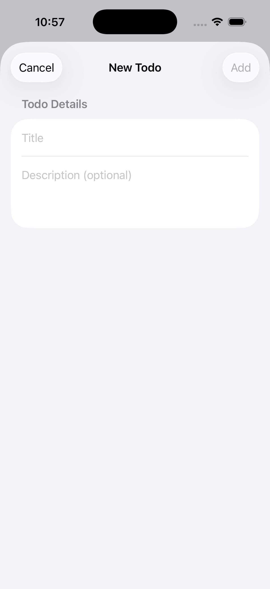
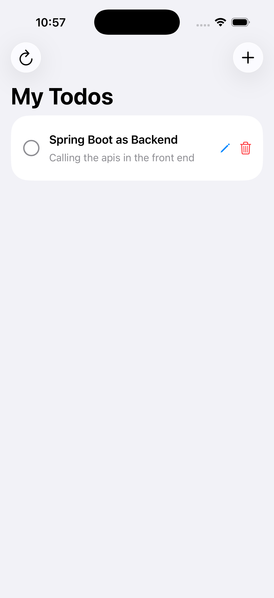
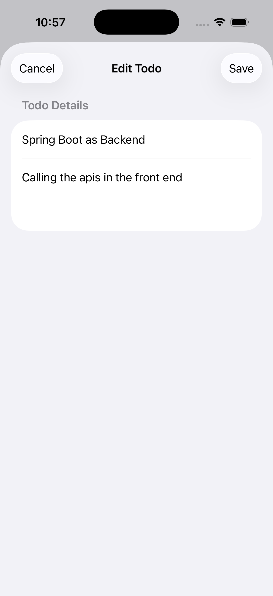

# 📝 ToDo List iOS App

A modern, feature-rich ToDo List application built with SwiftUI that connects to a RESTful API backend. Manage your tasks efficiently with a clean and intuitive interface.


### 🎓 Preparing for Interviews or Exams?
[](./Questions.md)

**Master the concepts behind this project!** We've prepared 50+ comprehensive questions covering SwiftUI, MVVM, async/await, networking, Combine, and more. Each question includes detailed answers with real examples from this codebase. Perfect for iOS development interview preparation! 🚀

## ✨ Features

- ✅ Create, read, update, and delete todos
- 🔄 Toggle todo completion status
- 📝 Add optional descriptions to todos
- 🎨 Clean and modern SwiftUI interface
- 🔌 RESTful API integration
- ⚡ Async/await for network operations
- 🔔 Error handling with user-friendly alerts
- 📱 Native iOS experience

## 🎥 Demo

<video src="images/demo.mov" controls width="80%"></video>

## 📸 Screenshots
<p align="center">
  
  
  
</p>

## 🛠 Technologies Used

- **SwiftUI** - Modern declarative UI framework
- **Combine** - Reactive programming framework
- **URLSession** - Networking with async/await
- **MVVM Architecture** - Clean separation of concerns
- **Codable** - JSON encoding/decoding
- **@MainActor** - Thread-safe UI updates

## 🏗 Architecture

The app follows the **MVVM (Model-View-ViewModel)** pattern:

- **Model** (`Todo`): Data structure representing a todo item
- **View** (`ContentView`, `AddTodoView`, `EditTodoView`, `TodoRowView`): SwiftUI views
- **ViewModel** (`TodoViewModel`): Business logic and state management
- **Service** (`TodoService`): API communication layer

## 📋 Requirements

- iOS 15.0+
- Xcode 13.0+
- Swift 5.5+

## 🚀 Getting Started

### Prerequisites

1. Make sure you have Xcode installed
2. Clone the backend repository and set it up:
   ```bash
   git clone https://github.com/DebugWithAryan/ToDoList-Backend-
   ```

### Installation

1. Clone this repository:
   ```bash
   git clone <your-repo-url>
   cd To-Do-List
   ```

2. Open the project in Xcode:
   ```bash
   open To-Do\ List.xcodeproj
   ```

3. Update the API endpoint in `ContentView.swift` if needed:
   ```swift
   private let baseUrl = "https://todoapp-en1q.onrender.com/api/todos"
   ```

4. Build and run the project (⌘+R)

## 🔗 Backend Repository

The backend for this app is built with Node.js and Express. You can find it here:

**[ToDo List Backend Repository](https://github.com/DebugWithAryan/ToDoList-Backend-)**

## 📱 Usage

### Adding a Todo
1. Tap the **+** button in the navigation bar
2. Enter a title (required)
3. Optionally add a description
4. Tap **Add** to create the todo

### Editing a Todo
1. Tap the **pencil icon** next to any todo
2. Update the title or description
3. Tap **Save** to apply changes

### Completing a Todo
- Tap the **circle icon** to mark a todo as complete
- The todo will show a checkmark and strikethrough text

### Deleting a Todo
- Tap the **trash icon** to delete a todo
- The todo will be immediately removed

### Refreshing
- Tap the **refresh icon** in the navigation bar to reload all todos

## 🌐 API Integration

The app integrates with a RESTful API with the following endpoints:

| Method | Endpoint | Description |
|--------|----------|-------------|
| GET | `/api/todos` | Fetch all todos |
| POST | `/api/todos` | Create a new todo |
| PUT | `/api/todos/:id` | Update a todo |
| DELETE | `/api/todos/:id` | Delete a todo |

## 🗂 Project Structure

```
To-Do List/
├── ContentView.swift          # Main views and UI components
├── TodoViewModel.swift        # ViewModel and business logic
└── Assets/                    # App assets and resources
```

## 🔑 Key Components

### Todo Model
```swift
struct Todo: Codable, Identifiable {
    let id: Int?
    let title: String
    let description: String?
    let completed: Bool
    let createdAt: String?
    let updatedAt: String?
}
```

### TodoService
Handles all API communication with async/await:
- `fetchTodo()` - Get all todos
- `createTodo()` - Create new todo
- `updateTodo()` - Update existing todo
- `deleteTodo()` - Delete todo

### TodoViewModel
Manages app state using `@Published` properties:
- `todos` - Array of todo items
- `isLoading` - Loading state
- `showError` - Error alert state
- `errorMessage` - Error message content

## 🎨 UI Components

- **ContentView**: Main list view with todos
- **AddTodoView**: Sheet for creating new todos
- **EditTodoView**: Sheet for editing existing todos
- **TodoRowView**: Reusable row component for displaying todos

## 🐛 Error Handling

The app includes comprehensive error handling:
- Network request failures
- JSON parsing errors
- API errors
- User-friendly error messages via alerts

## 🤝 Contributing

Contributions are welcome! Please feel free to submit a Pull Request.

1. Fork the project
2. Create your feature branch (`git checkout -b feature/AmazingFeature`)
3. Commit your changes (`git commit -m 'Add some AmazingFeature'`)
4. Push to the branch (`git push origin feature/AmazingFeature`)
5. Open a Pull Request

## 📝 License

This project is open source and available under the [MIT License](LICENSE).

## 👤 Author

**Aryan Jaiswal**

- GitHub: [@DebugWithAryan](https://github.com/DebugWithAryan)

## 🙏 Acknowledgments

- SwiftUI Documentation
- Apple Developer Resources
- The iOS Development Community

## 📞 Support

If you have any questions or need help, please open an issue in the repository.

---

⭐️ If you found this project helpful, please give it a star!
